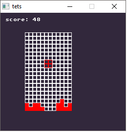

# tetris
a tetris clone written in C using SDL2



## How to build

### Prerequisite
in order to build the game you need to first download [premake4](https://premake.github.io/download.html#v4)
you also need to get [libSDL2](https://www.libsdl.org/) and [libSDL2_ttf](https://www.libsdl.org/projects/SDL_ttf/)

### Build Instructions
run following commands in your shell:
```bash
premake4 gmake
```
```bash
make config=release
```
that's it.

### Extra notes:
I built and tested the game on Window 7(32 bit), Windows 10(64 bit) and Ubuntu GNU/Linux (32/64 bit).

The source code can also be easily built on OSX too though I have not tested it yet. 

BTW I used GCC on linux and MinGW on windows to compile the code.


### How to contact me:

twitter: [@sepisoad](https://twitter.com/sepisoad)

github: [@sepisoad](https://github.com/sepisoad)